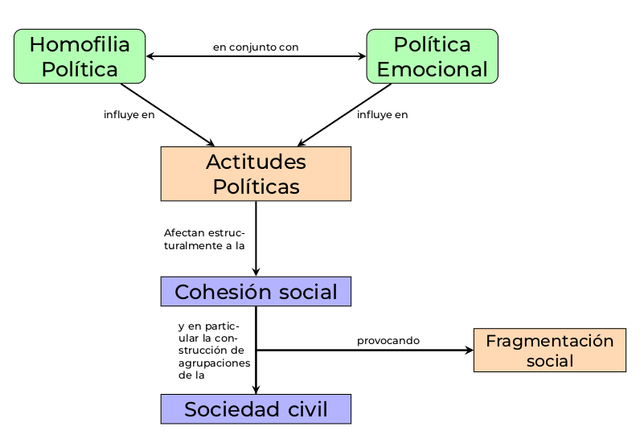
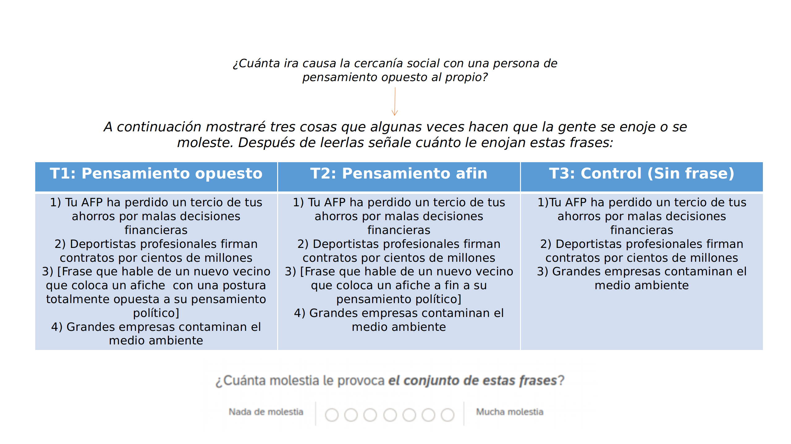
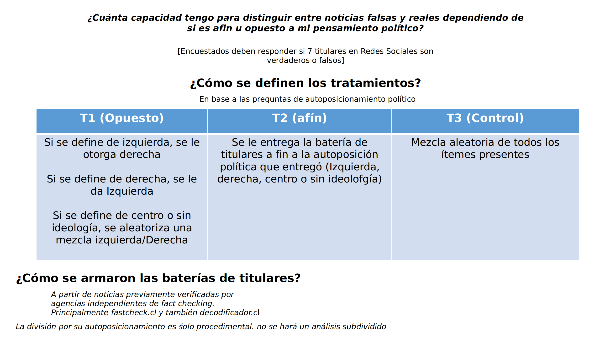
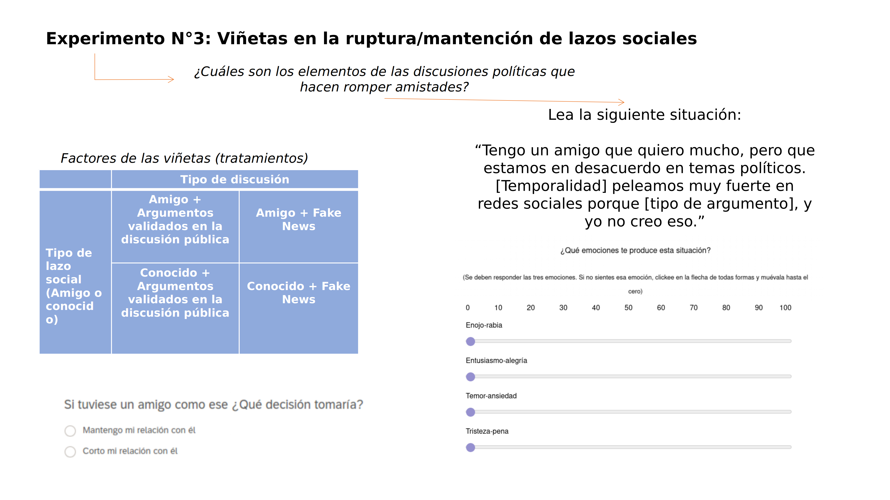
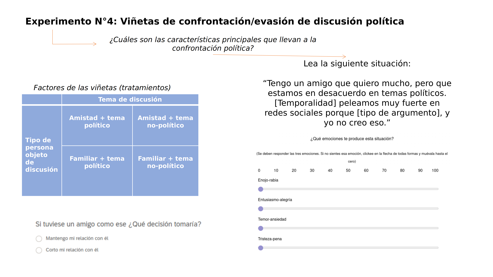

<style>
body {
text-align: justify}
</style>


```{r setup, include=FALSE}
knitr::opts_chunk$set(echo = TRUE)
knitr::opts_knit$set(root.dir = rprojroot::find_rstudio_root_file())
```

```{r, echo=FALSE, message=FALSE, warning=FALSE, include=F}
ipak <- function(pkg){
  new.pkg <- pkg[!(pkg %in% installed.packages()[, "Package"])]
  if (length(new.pkg)) 
    install.packages(new.pkg, dependencies = TRUE)
  sapply(pkg, require, character.only = TRUE)
}

# usage
packages <- c("tidyverse","dplyr","haven","ggplot2","readxl","summarytools", "patchwork","stringr", "tidyr","kableExtra")
ipak(packages)
```
```{r, echo=FALSE}
TablaEmo <-readRDS("Results/Tables/Tabla-emociones.rds")
TablaExperi <-readRDS("Results/Tables/Tabla-resultados-experimentos.rds")
```


## **Pregunta de investigación y propuesta**

En los últimos años hemos visto cómo las redes sociales e internet han modificado elementos
esenciales para la configuración de nuestras actitudes políticas como la tendencia sostenida a la
homofília política (Ackland & Shorish, 2014; M. McPherson et al., 2001) que ha llevado a la creación
de “cámaras de eco” y “burbujas de filtro”y el surgimiento de una política basada fuertemente en las
emociones tanto para la organización y movilización social de la sociedad civil (Castells, 2012;
Papacharissi, 2015) como también para participar y deliberar en el espacio público, siendo la ira, el
miedo y la felicidad emociones vehiculantes de una gran cantidad de acciones y movilizaciones que
ha provocado un gran cambio cultural y político tanto en elecciones como la de Donald Trump el año
2016, la elección de Jair Bolsonaro pero también movimientos como el feminista y las revueltas de
octubre del 2019 en Chile. 

En esta última la prensa y la academia han observado un creciente fenómeno de intolerancia política y 
polarización que nos lleva a pensar la siguiente pregunta para esta investigación: _¿Nuestro entorno social y modos de uso de Internet polarizan nuestras actitudes y emociones ante personas de pensamiento político opuesto?_


El objetivo de esta investigación es analizar cómo laconstrucción de lazos sociales homofílicos y los nivelesde uso de internet modifican la conducta política en laspersonas cuando son enfrentados a ideas opuestas a las propias. 

En particular se medirán las características de los lazos sociales en contextos de posiciones políticas opuestas y las emociones asociadas a ella.


<center></center>

## **Objetivos de Investigación**

### _Objetivo general_

* Analizar los efectos de la homofília política y ciudadanía digital en la conducta política de población chilena.

### _Objetivos Específicos_

* Conocer el nivel de homofília política presente en la muestra poblacional elegida a partir de una escala validada

* Comprender la capacidad de discernir entre información falsa y real circulante en redes sociales, según si es pensamiento afín u opuesto.

* Analizar los niveles de ira en la población según cercanía social con personas políticamente distantes.

* Analizar el despliegue de emociones (principalmente enojo, entusiasmo, tristeza y temor) en la ruptura o mantención de lazos sociales, y en la disposición a discutir ente familiares o amigos.

* Comparar esta construcción de actitudes y emociones entre personas según el grado de homofília política y según el nivel de ciudadanía digital.

## **Hipótesis**


* Se observa una relación significativa de aumento de ira por cercaníasocial a una persona de pensamiento político opuesto, respecto delgrupo de control

* Habrá menor precisión de calificación noticias falsas y reales cuando se trata de calificar titulares de pensamiento contrario por sobre los titulares de noticias de pensamiento afín o grupo de control.

* Existe una tendencia mayor a romper lazos sociales cuando se trata de una argumentación política opuesta a la propia basada en desinformación, que en argumentaciones validadas dentro del debate público.

* Se observan mayores niveles de enojo-rabia  en desmedro del temor, entusiasmo o tristeza cuando se enfrenta a argumentaciones basadas en desinformación.

* Existe una mayor tendencia a enfrentar discusiones políticas cuando hay desacuerdo en temas no-políticos que en temas políticos, tanto si es con familiares o con amigos.

* Se observa mayores niveles de enojo en desmedro del temor, entusiasmo y tristeza en el enfrentamiento a amigos, mientras que cuando se enfrentan a familiares aumenta la tristeza y el temor en desmedro del entusiasmo y el enojo

<br>
<br>
 <center> <h2><font size="6">[**¡Probemos la encuesta experimental!**](https://unisdc.qualtrics.com/jfe/form/SV_249PrQV09EzfzPU)</font></h2></center>
<br>
<br>
<br>
<br>

## **Diseño experimental y flujo**

Para materializar esta propuesta, se realiza una encuesta experimental en línea y asincrónica, realizada en la plataforma _Qualtrics_. La encuesta será hecha en una muestra controlada por cuotas (en base a edad y nivel de ingreso) de 750 personas reclutadas desde el panel CESS. 

Para controlar variables relevantes para esta investigación, se ha decidido hacer una aleatorización en bloque repartirá en cada condición experimental a las personas según su nivel de ciudadanía digital, y según su nivel de pertenencia a burbujas de pensamiento y homofilia política, preguntas consideradas en el flujo presentado a continuación.

<br>
<br>


<br>
<br>

El flujo está representado por tres grandes secciones: caracterización sociodemográfica, ciudadanía digital y posición política, y finalmente cuatro preguntas experimentales


## **Diseño de preguntas y resultados**
<br>
Mostramos acá los primeros resultados pre-eliminares de este pilotaje. por cuestiones de tamaño de la muestra ysu excesiva homogeneidad no se mostrarán las características de la muestra; más bien lo relevante es ver el poder que tienen los tratamientos de cada pregunta experimental.
<br>


 <center><h3>**Experimento 1 - Experimento de lista sobre tolerancia a cercanía social a una persona**</h3></center>



<br>
<br>
#### _Resultados_
<br>

```{r, echo=FALSE, message=F, include=FALSE}

EP1 <-TablaExperi[[1]]%>%
  kbl(align = c(rep("c", 7), rep("r", 5), caption = "hola"), digits = 2)

```
```{r, echo=FALSE, message=F, warning=F}
EP1%>%
  kable_styling(bootstrap_options = c("striped","responsive"), font_size = 17)
```

<br>
<br>
Como se puede apreciar, existe una disminusión de los sentimientos de molestia/rabia en las personas cuando se enfrentan a una persona de pensamiento similar. Sin embargo el problema que existe es que _la persona de pensamiento opuesto no tiene el mismo efecto_, siendo prácticamente igual al tratamiento de control.

<center><h5>**¿Por qué ocurre esto?**</h5></center>
<br>
<center>_Escucho hipótesis_</center> 
<br>
<br>

 <center><h3>**Experimento 2 - acertividad en Fake News **<h3></center>
 
 
<br>
<br>

#### _Resultados_
<br>

```{r, echo=F, include=F, warning=F}

EP2 <-TablaExperi[[2]]%>%
  kbl(align = c(rep("c", 7), rep("r", 5), caption = "hola"), digits = 2)
```

```{r, echo=F,warning=F}
EP2%>%
  kable_styling(bootstrap_options = c("striped","responsive"), font_size = 17)
```
<br>
<br>
Como se puede observar, en general la media de tasa de acierto a los titulares es más bien baja. Sin embargo (y para mi sorpresa) existe mayor impresición cuando se trata de evaluar los titulares relacionados con la propia tendencia política antes que con una opuesta, la cual tiene alto nivel de precisión. Esto puede deberse según la teoría de la identidad y los efectos que tienen las cámaras de eco de internar información de manera irreflexiva cuando se trata de personas identitariamente similares.

Este experimento tiene un buen desempeño y esperamos que siga de esta forma.


 <center><h3>**Experimento 3 - Tendencia a romper lazos sociales con gente de pensamiento opuesto**<h3></center>

<br>


<br>
<br>

#### _Resultados_
<br>
```{r, echo=F, include=F, warning=F}

EP3 <-TablaExperi[[3]]%>%
  kbl(align = c(rep("c", 7), rep("r", 5), caption = "hola"), digits = 2, full_width = T)
```

```{r, echo=F,warning=F}
EP3%>%
  kable_styling(bootstrap_options = c("striped","responsive"), font_size = 15)
```

En este experimento hay una falla importante donde hay una tendencia clara a mantener los lazos sociales, independiente del tipo y del nivel 


 <center><h3>**Experimento 4 - Tendencia a discutir o evadir discusión, según tipo de lazo social**<h3></center>




#### _Resultados_
<br>
<br>
```{r, echo=F, include=F, warning=F}

EP4 <-TablaExperi[[4]]%>%
  kbl(align = c(rep("c", 7), rep("r", 5), caption = "hola"), digits = 2)
```

```{r, echo=F,warning=F}
EP4%>%
  kable_styling(bootstrap_options = c("striped","responsive"), font_size = 15, full_width = T)
```